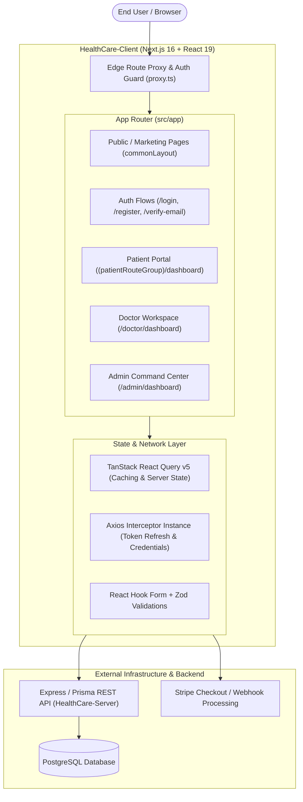
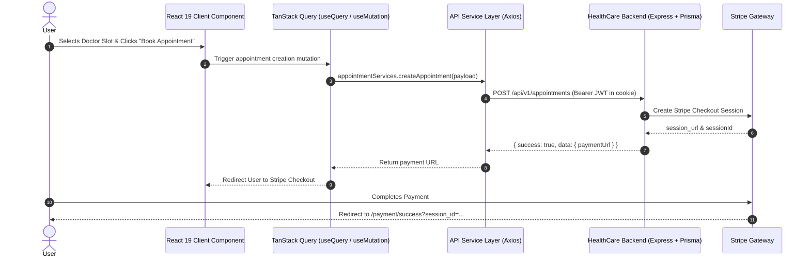

# 🏥 HealthCare - Enterprise Telemedicine & Healthcare Client Platform

[](https://nextjs.org/)
[](https://react.dev/)
[](https://www.typescriptlang.org/)
[](https://tailwindcss.com/)
[](https://tanstack.com/query/latest)
[](https://recharts.org/)
[](LICENSE)

---

## 📑 Table of Contents

- [1. Executive Summary](#1-executive-summary)
- [2. System Architecture](#2-system-architecture)
  - [2.1 High-Level Architecture](#21-high-level-architecture)
  - [2.2 Project & Directory Layout](#22-project--directory-layout)
  - [2.3 Data Flow & State Synchronization](#23-data-flow--state-synchronization)
- [3. Full Tech Stack Specifications](#3-full-tech-stack-specifications)
- [4. Role-Based Access Control (RBAC) Matrix](#4-role-based-access-control-rbac-matrix)
  - [4.1 Access Control Matrix](#41-access-control-matrix)
  - [4.2 Auth Flow & Edge Route Guarding](#42-auth-flow--edge-route-guarding)
- [5. Feature & Module Deep Dive](#5-feature--module-deep-dive)
  - [5.1 Public Discovery & Marketing Portal](#51-public-discovery--marketing-portal)
  - [5.2 Patient Portal (`/dashboard`)](#52-patient-portal-dashboard)
  - [5.3 Doctor Clinical Workspace (`/doctor/dashboard`)](#53-doctor-clinical-workspace-doctordashboard)
  - [5.4 Administrator Command Center (`/admin/dashboard`)](#54-administrator-command-center-admindashboard)
- [6. Environment Variable Configurations](#6-environment-variable-configurations)
- [7. API & Service Layer Integration](#7-api--service-layer-integration)
- [8. Installation & Local Development](#8-installation--local-development)
- [9. Production Build & Deployment](#9-production-build--deployment)
- [10. Scripts Reference](#10-scripts-reference)
- [11. License & Acknowledgments](#11-license--acknowledgments)

---

## 1. Executive Summary

**HealthCare Client** is an enterprise-grade, high-performance web application designed for modern digital healthcare ecosystems. Built atop the cutting-edge **Next.js 16 App Router**, **React 19**, and **Tailwind CSS v4**, this application provides a centralized, omnichannel solution connecting patients, healthcare specialists, clinical administrators, and super-administrators in a secure, compliant, and accessible interface.

### Key Value Propositions
- **Unified Telemedicine Portal**: Streamlined discovery, doctor specialty filtering, dynamic slot booking, and integrated Stripe Checkout.
- **Role-Segmented Workspaces**: Tailored user experiences with dedicated dashboards for Patients, Doctors, Admins, and Super Admins.
- **Enterprise-Grade Security**: Dual-layer authorization with JWT access/refresh token rotation, Better-Auth session verification, and edge route guarding via middleware.
- **Real-Time Clinical Operations**: Automated schedule allocation, digital prescription generation, electronic health records (EHR), and interactive analytic charts.
- **Adaptive Visual Design**: Custom medical design system with full Light and Dark mode theming powered by CSS tokens and accessible UI primitives.

---

## 2. System Architecture

### 2.1 High-Level Architecture



---

### 2.2 Project & Directory Layout

```text
HealthCare-Client/
├── public/                                  # Static assets, SVG illustrations, logos
├── src/
│   ├── app/                                 # Next.js App Router file-system routing
│   │   ├── (commonLayout)/                  # Public layouts (Navbar + Footer)
│   │   │   ├── consultation/                # Doctor discovery & booking catalog
│   │   │   ├── diagnostics/                 # Pathology tests & lab packages
│   │   │   ├── health-plans/                # Subscription health packages
│   │   │   ├── medicine/                    # Online pharmacy catalog
│   │   │   ├── ngos/                        # Community healthcare & charity drives
│   │   │   ├── login/                       # Multi-role authentication page
│   │   │   ├── register/                    # Patient & doctor onboarding
│   │   │   ├── verify-email/                # 6-digit OTP email verification
│   │   │   ├── forget-password/             # Password reset request
│   │   │   ├── reset-password/              # New password submission
│   │   │   └── layout.tsx                   # Common layout wrapper
│   │   ├── (dashboardLayout)/               # Protected dashboard shell (Sidebar + Topbar)
│   │   │   ├── (commonProtectedLayout)/     # Shared routes (/my-profile, /change-password)
│   │   │   ├── (patientRouteGroup)/         # Patient workspace
│   │   │   │   ├── dashboard/               # Patient metrics & quick actions
│   │   │   │   │   ├── book-appointments/   # Direct appointment wizard
│   │   │   │   │   ├── health-record/       # EHR: medical conditions, blood group, files
│   │   │   │   │   ├── my-appointments/     # Active & past consultations
│   │   │   │   │   ├── my-prescriptions/    # Prescriptions received from doctors
│   │   │   │   │   └── payment/             # Patient payment ledger
│   │   │   │   └── payment/                 # Stripe checkout return handlers
│   │   │   │       ├── success/             # Appointment confirmation screen
│   │   │   │       └── cancel/              # Payment retry screen
│   │   │   ├── doctor/                      # Doctor workspace
│   │   │   │   └── dashboard/               # Clinical summary & KPI cards
│   │   │   │       ├── appointments/        # Patient appointments & teleconsultation
│   │   │   │       ├── my-schedules/        # Weekly slot management & activation
│   │   │   │       ├── my-reviews/          # Patient ratings & feedback
│   │   │   │       └── prescriptions/       # Digital prescription generator
│   │   │   └── admin/                       # Administration workspace
│   │   │       └── dashboard/               # Executive analytics with Recharts
│   │   │           ├── admins-management/   # Super Admin: Admin user provisioning
│   │   │           ├── doctors-management/  # Doctor verification & status control
│   │   │           ├── patients-management/ # Patient user accounts & EHR oversight
│   │   │           ├── specialties-management/ # Medical specialty taxonomies & icons
│   │   │           ├── schedules-management/   # Global master schedule creation
│   │   │           ├── doctor-schedules-managament/ # Doctor slot assignment
│   │   │           ├── appointments-management/ # System-wide appointment audit
│   │   │           ├── prescriptions-management/ # Global prescription ledger
│   │   │           ├── payments-management/ # Transaction history & Stripe ledger
│   │   │           └── reviews-management/  # Content moderation on doctor reviews
│   │   ├── globals.css                      # Tailwind v4 theme tokens & color variables
│   │   ├── layout.tsx                       # Root layout & global providers
│   │   ├── loading.tsx                      # Top-level route streaming skeleton
│   │   ├── not-found.tsx                    # Accessible 404 handler
│   │   └── page.tsx                         # High-impact landing page
│   ├── components/                          # UI components
│   │   ├── modules/                         # Feature-specific module components
│   │   │   ├── auth/                        # LoginForm, RegisterForm, RoleLoginButtons
│   │   │   ├── consultation/                # DoctorCard, BookAppointmentModal, FilterBar
│   │   │   ├── dashboard/                   # Analytics charts, QuickStats, SummaryWidgets
│   │   │   ├── home/                        # HeroSection, FeaturedDoctors, HealthPlans
│   │   │   └── schedules/                   # ScheduleGrid, SlotPicker, AssignModal
│   │   ├── shared/                          # Reusable cross-application components
│   │   │   ├── Navbar.tsx                   # Public navigation header
│   │   │   ├── Footer.tsx                   # Platform footer with legal & site links
│   │   │   ├── DashboardSidebar.tsx         # Role-aware expandable navigation sidebar
│   │   │   ├── DashboardHeader.tsx          # Dashboard topbar with profile dropdown
│   │   │   ├── DataTable.tsx                # Generic paginated/sortable table component
│   │   │   ├── Pagination.tsx               # Accessible pagination controls
│   │   │   ├── SearchAndFilterBar.tsx       # Live debounce search & filter inputs
│   │   │   ├── ThemeToggle.tsx              # Light / Dark mode switcher
│   │   │   └── LogoutConfirmModal.tsx       # Confirmation dialog for session termination
│   │   └── ui/                              # Shadcn & Base-UI primitives (Button, Dialog, etc.)
│   ├── hooks/                               # Custom hooks (auth, debouncing, media queries)
│   ├── lib/                                 # Utilities (Axios interceptor, JWT, cookie management)
│   ├── providers/                           # ReactQueryProvider, ThemeProvider
│   ├── proxy.ts                             # Next.js edge route protection & middleware logic
│   ├── services/                            # Strongly-typed API client service methods
│   ├── types/                               # TypeScript models, DTOs, and interface definitions
│   └── zod/                                 # Zod validation schemas for all application forms
├── package.json                             # Dependencies & runtime scripts
├── tsconfig.json                            # TypeScript configuration
└── next.config.ts                           # Next.js compiler & domain image whitelist config
```

---

### 2.3 Data Flow & State Synchronization



---

## 3. Full Tech Stack Specifications

| Layer / Category | Technology | Version | Purpose & Rationale |
|---|---|---|---|
| **Core Framework** | [Next.js](https://nextjs.org/) | `16.3.2` | App Router architecture, Server Components, Streaming SSR, Edge Route Proxy |
| **UI Library** | [React](https://react.dev/) | `19.2.8` | Modern declarative UI, Concurrent features, Action hooks |
| **Type System** | [TypeScript](https://www.typescriptlang.org/) | `^5.0.0` | Strict type safety across components, service layers, and DTOs |
| **CSS & Design Engine** | [Tailwind CSS](https://tailwindcss.com/) | `v4.0.0` | Next-generation CSS-first styling engine with customized HSL variables |
| **UI Primitives** | [@base-ui/react](https://base-ui.com/) & [Shadcn](https://ui.shadcn.com/) | `^1.7.0` | WAI-ARIA compliant, unstyled, fully accessible dialogs, popovers, and menus |
| **Asynchronous State** | [TanStack React Query](https://tanstack.com/query) | `^5.102.3` | Server state caching, optimistic UI updates, automated background invalidation |
| **HTTP Client** | [Axios](https://axios-http.com/) | `^1.19.0` | Customized client with credential forwarding, request/response interceptors |
| **Form Management** | [React Hook Form](https://react-hook-form.com/) | `^7.86.0` | Uncontrolled high-performance form state with minimal re-renders |
| **Schema Validation** | [Zod](https://zod.dev/) | `^4.4.3` | Schema definition and client-side validation parsing for all forms |
| **Data Visualization** | [Recharts](https://recharts.org/) | `^3.10.1` | Responsive SVG charts (Line, Bar, Area, Pie) for administrator analytics |
| **Date & Scheduling** | [date-fns](https://date-fns.org/) & [react-day-picker](https://daypicker.dev/) | `^4.4.0` | Timezone formatting, calendar day pickers, time-slot conflict calculations |
| **Icons & Visuals** | [Lucide React](https://lucide.dev/) | `^1.34.0` | Cohesive, lightweight SVG icon package |
| **Theme Management** | [next-themes](https://github.com/pacocoursey/next-themes) | `^0.4.6` | Flawless dark/light mode switching with zero layout shift |
| **Token Verification** | [jsonwebtoken](https://github.com/auth0/node-jsonwebtoken) | `^9.0.3` | Decodes JWT payload at middleware edge for instant role routing |

---

## 4. Role-Based Access Control (RBAC) Matrix

The application implements a strict, multi-tiered access control model across five distinct permission tiers: **Guest**, **Patient**, **Doctor**, **Admin**, and **Super Admin**.

### 4.1 Access Control Matrix

| Route / Module Path | Guest | Patient | Doctor | Admin | Super Admin | Description |
|---|:---:|:---:|:---:|:---:|:---:|---|
| `/` (Landing Page) | ✅ | ✅ | ✅ | ✅ | ✅ | Public overview, featured doctors, testimonials |
| `/consultation` | ✅ | ✅ | ✅ | ✅ | ✅ | Doctor catalog & specialty directory |
| `/diagnostics`, `/health-plans`, `/medicine`, `/ngos` | ✅ | ✅ | ✅ | ✅ | ✅ | Public health discovery content |
| `/login`, `/register`, `/verify-email` | ✅ | 🔄 *(Redirect)* | 🔄 *(Redirect)* | 🔄 *(Redirect)* | 🔄 *(Redirect)* | Auth pages (authenticated users auto-redirected to dashboard) |
| `/my-profile`, `/change-password` | ❌ | ✅ | ✅ | ✅ | ✅ | Common authenticated user account management |
| `/dashboard` (Patient Home) | ❌ | ✅ | ❌ | ❌ | ❌ | Patient appointment summary & health stats |
| `/dashboard/book-appointments` | ❌ | ✅ | ❌ | ❌ | ❌ | Direct booking & appointment workflow |
| `/dashboard/my-appointments` | ❌ | ✅ | ❌ | ❌ | ❌ | Patient appointment history & teleconsultation links |
| `/dashboard/my-prescriptions` | ❌ | ✅ | ❌ | ❌ | ❌ | Digital prescriptions received by patient |
| `/dashboard/health-record` | ❌ | ✅ | ❌ | ❌ | ❌ | Patient personal electronic health record (EHR) |
| `/dashboard/payment` | ❌ | ✅ | ❌ | ❌ | ❌ | Patient transaction and receipt ledger |
| `/doctor/dashboard` | ❌ | ❌ | ✅ | ❌ | ❌ | Doctor clinical overview & KPI analytics |
| `/doctor/dashboard/appointments` | ❌ | ❌ | ✅ | ❌ | ❌ | Doctor patient queue & consultation room |
| `/doctor/dashboard/my-schedules` | ❌ | ❌ | ✅ | ❌ | ❌ | Doctor consultation slot configuration |
| `/doctor/dashboard/prescriptions` | ❌ | ❌ | ✅ | ❌ | ❌ | Clinical prescription issuance tool |
| `/doctor/dashboard/my-reviews` | ❌ | ❌ | ✅ | ❌ | ❌ | Patient reviews and rating feedback |
| `/admin/dashboard` | ❌ | ❌ | ❌ | ✅ | ✅ | Executive revenue & appointment analytics |
| `/admin/dashboard/doctors-management` | ❌ | ❌ | ❌ | ✅ | ✅ | Doctor credential verification & suspension |
| `/admin/dashboard/patients-management` | ❌ | ❌ | ❌ | ✅ | ✅ | Patient accounts & health record overview |
| `/admin/dashboard/specialties-management` | ❌ | ❌ | ❌ | ✅ | ✅ | CRUD operations for medical specialties |
| `/admin/dashboard/schedules-management` | ❌ | ❌ | ❌ | ✅ | ✅ | Master time slot generator |
| `/admin/dashboard/doctor-schedules-managament` | ❌ | ❌ | ❌ | ✅ | ✅ | Slot assignment to registered doctors |
| `/admin/dashboard/payments-management` | ❌ | ❌ | ❌ | ✅ | ✅ | System-wide Stripe transaction audit |
| `/admin/dashboard/reviews-management` | ❌ | ❌ | ❌ | ✅ | ✅ | Content moderation of patient reviews |
| `/admin/dashboard/admins-management` | ❌ | ❌ | ❌ | ❌ | ✅ | **Super Admin only**: Provision new administrators |

---

### 4.2 Auth Flow & Edge Route Guarding

Route security is enforced on every incoming request through `src/proxy.ts` (Next.js Middleware proxy):

1. **Token Extraction**: Middleware inspects `accessToken`, `refreshToken`, and Better-Auth session tokens from HTTP cookies.
2. **Signature & Expiry Check**: Evaluates token validity against `JWT_ACCESS_SECRET`. If the token is near expiration, it triggers an automated proactive refresh against `/auth/refresh-token`.
3. **Role Validation**: If an unauthenticated user attempts to access protected routes, they are redirected to `/login?redirect=<path>`. If an authenticated user attempts to access a forbidden role route (e.g. Patient accessing `/admin/dashboard`), they are safely redirected to their default role dashboard.

---

## 5. Feature & Module Deep Dive

### 5.1 Public Discovery & Marketing Portal
- **Interactive Hero & Role Launcher**: Quick-login buttons for testing (`Patient`, `Doctor`, `Admin`), search-by-specialty shortcuts, and platform statistics.
- **Doctor Consultation Directory (`/consultation`)**:
  - Live search by doctor name, qualification, and specialty.
  - Interactive doctor profile card featuring experience, consultation fee, and available slots.
- **Specialized Services Showcase**:
  - **Health Plans (`/health-plans`)**: Individual, family, and corporate subscription tiers.
  - **Diagnostics (`/diagnostics`)**: Comprehensive lab test directory with home sample collection details.
  - **Online Pharmacy (`/medicine`)**: Prescription medicine showcase and wellness categories.
  - **Community NGOs (`/ngos`)**: Non-profit health drives and subsidized treatment centers.

---

### 5.2 Patient Portal (`/dashboard`)
- **Executive Patient Dashboard**: Active consultations summary, prescription counts, and recent transactions.
- **Appointment Lifecycle**:
  - Direct booking modal with dynamic date picker and conflict-free time slots.
  - Real-time status indicators (`SCHEDULED`, `INPROGRESS`, `COMPLETED`, `CANCELED`).
  - Seamless Stripe payment checkout flow.
- **Electronic Health Record (EHR)**:
  - Personal health indicators: Blood group, allergies, past medical conditions, ongoing treatments, and clinical document uploads.
- **Digital Prescriptions**:
  - Clean view and PDF print capabilities for medications, instructions, dosages, and follow-up dates.

---

### 5.3 Doctor Clinical Workspace (`/doctor/dashboard`)
- **Clinical Performance Analytics**: KPI indicators for treated patients, today's schedule, total earnings, and rating averages.
- **Schedule Management (`/doctor/dashboard/my-schedules`)**:
  - View assigned time slots.
  - Enable or disable availability per day/week with instant database sync.
- **Consultation Room & Appointments**:
  - Patient queue with quick access to patient medical histories.
  - One-click prescription issuance interface.
- **Digital Prescription Generator**:
  - Multi-item medication form with dosage intervals, before/after meal rules, and clinical instructions.

---

### 5.4 Administrator Command Center (`/admin/dashboard`)
- **Executive Analytics Engine**:
  - Visual charts rendered via `Recharts` for revenue growth, appointment breakdown, and user onboarding trends.
- **Doctor & Staff Administration**:
  - Review medical licenses, approve doctor registrations, set specializations, and manage operational statuses.
- **Specialty & Catalog Taxonomy**:
  - Create, update, or remove medical departments with custom icon URLs.
- **Master Scheduling Engine**:
  - Generate bulk time slots across daily intervals and assign slots to medical staff.
- **Super-Admin Governance**:
  - Dedicated `/admin/dashboard/admins-management` view to provision and audit administrative staff.

---

## 6. Environment Variable Configurations

Create a `.env.local` file in the root of the project:

```bash
# ==============================================================================
# BACKEND API & AUTHENTICATION CONFIGURATION
# ==============================================================================

# Base URL for the HealthCare REST API (Express / Node.js backend)
NEXT_PUBLIC_API_BASE_URL=http://localhost:5000/api/v1

# Base URL for Better-Auth authentication endpoints
NEXT_PUBLIC_BETTER_AUTH_URL=http://localhost:5000/api/auth

# Secret key used to decode & verify JWT access tokens at Next.js Edge Middleware
# (Must match the JWT_ACCESS_SECRET configured in HealthCare-Server)
JWT_ACCESS_SECRET=your_super_secret_jwt_access_key_here

# ==============================================================================
# PAYMENT GATEWAY (STRIPE)
# ==============================================================================

# Stripe Publishable Key for client-side checkout redirection
NEXT_PUBLIC_STRIPE_PUBLISHABLE_KEY=pk_test_your_stripe_publishable_key
```

### Environment Variable Matrix

| Variable | Required | Scope | Description | Default / Example |
|---|:---:|:---:|---|---|
| `NEXT_PUBLIC_API_BASE_URL` | **Yes** | Client & Server | Base endpoint for backend CRUD APIs | `http://localhost:5000/api/v1` |
| `NEXT_PUBLIC_BETTER_AUTH_URL`| **Yes** | Client & Server | Auth endpoint for Better-Auth sessions | `http://localhost:5000/api/auth` |
| `JWT_ACCESS_SECRET` | **Yes** | Server / Edge | Secret used to decrypt JWT in middleware | `32+ characters secret` |
| `NEXT_PUBLIC_STRIPE_PUBLISHABLE_KEY` | **Optional** | Client | Public Stripe key for checkout initialization | `pk_test_...` |

---

## 7. API & Service Layer Integration

The application utilizes a modular API service layer located in `src/services/`. Every service function is strongly typed and interfaces with the centralized Axios instance (`src/lib/axios/axiosInstance.ts`):

```text
src/services/
├── auth.services.ts          # Login, register, logout, OTP verify, password recovery
├── doctor.services.ts        # Doctor directory, search, profile details, updates
├── schedule.services.ts      # Slot generation, doctor availability, assignments
├── appointment.services.ts   # Booking creation, status updates, patient visits
├── prescription.services.ts  # Clinical prescription creation & retrieval
├── specialty.services.ts     # Specialty CRUD operations & category taxonomies
├── patient.services.ts       # Health records, medical profile updates
├── review.services.ts        # Patient rating submissions & moderation
├── admin.services.ts         # Administrative operations (doctors, patients, admins)
├── stats.services.ts         # KPI metrics, platform revenue, dashboard aggregates
└── rag.services.ts           # AI / Knowledge retrieval assistant integrations
```

### Service Invocation Pattern Example

```typescript
// Example: Querying Doctor Appointments with TanStack Query
import { useQuery } from "@tanstack/react-query";
import { appointmentServices } from "@/services/appointment.services";

export function useDoctorAppointments(params?: Record<string, any>) {
  return useQuery({
    queryKey: ["doctor-appointments", params],
    queryFn: async () => {
      const response = await appointmentServices.getDoctorAppointments(params);
      return response.data;
    },
    staleTime: 1000 * 60 * 5, // 5 minutes cache
  });
}
```

---

## 8. Installation & Local Development

### Prerequisites
- **Node.js**: `v20.x` or higher (LTS recommended)
- **Package Manager**: `pnpm` (`v11.x` recommended), `yarn`, or `npm`
- **Backend Service**: Ensure `HealthCare-Server` is running on `http://localhost:5000`

---

### Step-by-Step Setup

1. **Clone the repository**:
   ```bash
   git clone https://github.com/rasel754/HealthCare-Client.git
   cd HealthCare-Client
   ```

2. **Install project dependencies**:
   ```bash
   pnpm install
   ```

3. **Configure environment variables**:
   ```bash
   cp .env.example .env.local
   # Update the values in .env.local with your backend configuration
   ```

4. **Run the development server**:
   ```bash
   pnpm dev
   ```

5. **Open the application**:
   Navigate to [http://localhost:3000](http://localhost:3000) in your web browser.

---

## 9. Production Build & Deployment

### 9.1 Production Build

To validate TypeScript types, build production assets, and optimize bundles:

```bash
# 1. Run ESLint checks
pnpm lint

# 2. Compile and optimize production bundle
pnpm build

# 3. Launch optimized production server
pnpm start
```

### 9.2 Deployment Recommendations

- **Vercel (Recommended)**:
  1. Import the repository into Vercel.
  2. Framework Preset will automatically detect **Next.js**.
  3. Add environment variables (`NEXT_PUBLIC_API_BASE_URL`, `JWT_ACCESS_SECRET`, `NEXT_PUBLIC_STRIPE_PUBLISHABLE_KEY`).
  4. Deploy with automatic CI/CD and Edge Middleware support.

- **Docker Containerization**:
  The Next.js build can be packaged using standard standalone Node.js output (`output: 'standalone'` in `next.config.ts`).

---

## 10. Scripts Reference

| Script | Command | Purpose |
|---|---|---|
| `dev` | `next dev` | Launches local development server with Hot Module Replacement (HMR) on port `3000` |
| `build` | `next build` | Compiles the Next.js application for production deployment |
| `start` | `next start` | Runs the compiled production server |
| `lint` | `eslint` | Analyzes code for quality, syntax errors, and Next.js best practices |

---

## 11. License & Acknowledgments

This project is licensed under the **MIT License**.

- Built with [Next.js](https://nextjs.org/) & [React](https://react.dev/).
- Styled with [Tailwind CSS v4](https://tailwindcss.com/) & [Lucide Icons](https://lucide.dev/).
- Primitives powered by [Shadcn UI](https://ui.shadcn.com/) & [Base UI](https://base-ui.com/).
- Charts powered by [Recharts](https://recharts.org/).
